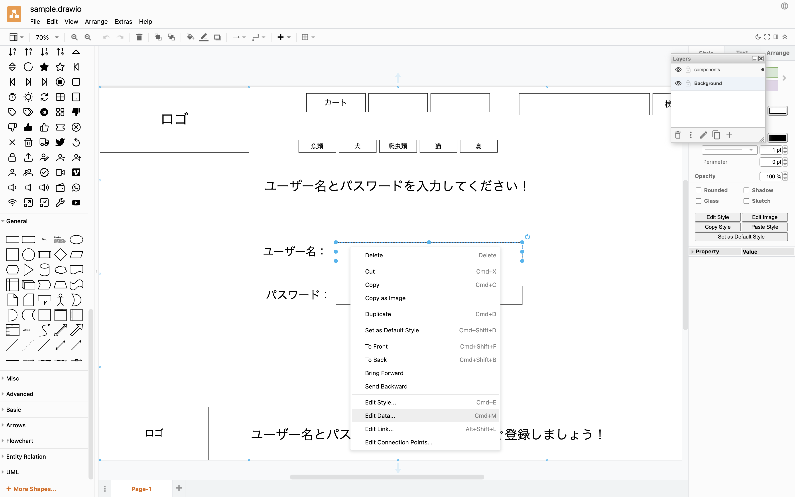
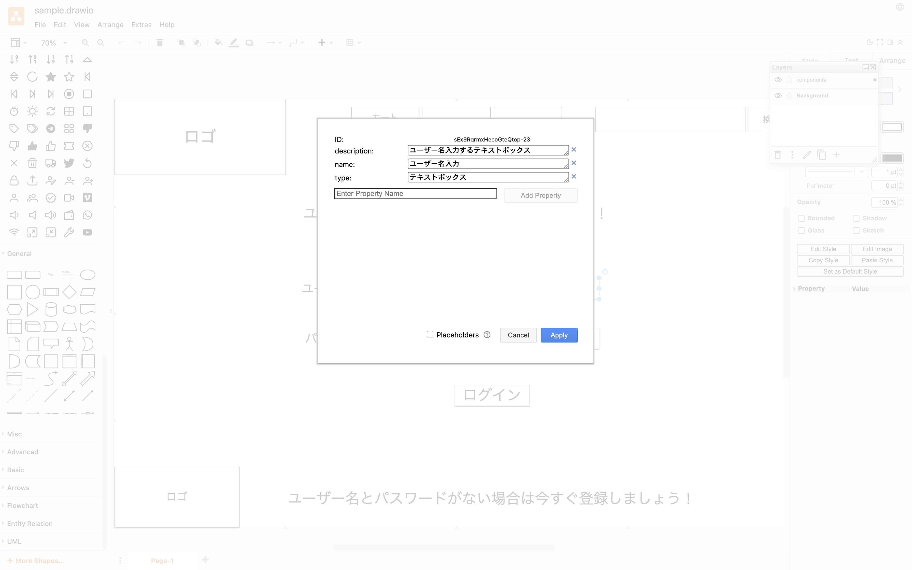

# 画面レイアウト定義半自動化ツール
## Table of contents
1. [前提条件](#前提条件)
2. [開発環境](#開発環境)
3. [操作手順](#操作手順)
4. [拡張の仕方](#拡張の仕方)
## 前提条件
+ 画面レイアウトの作成にはdraw.ioを使うこと
+ draw.ioの実行ファイルパスが環境変数に設定されていること
## 開発環境
+ MacOS X
+ python >= 3.10.7
+ pip >= 22.2.2
## 操作手順
1. libs下のライブラリをインストール
```
~$ pip install -r libs/requirements.txt
```
2. draw.ioで画面レイアウト定義の対象となるコンポーネントに情報を負荷する
    1. 対象となる画面部品を右クリック->[Edit Data...]を押下
    
    2. Key-Valueを設定する
        + name: 画面部品名(ラベル)
        + type: 画面部品のタイプ
        + description: 画面部品の説明
        + range: 表示範囲
        
3. 保存したdraw.ioファイルをinputディレクトリ下に配置
4. .envファイルに、draw.ioコマンドの実行パスと一時ディレクトリのパスを設定
``` .env
DRAW_IO_EXECUTABLE=/PATH/TO/draw.io
TMP_DIR=/TMP/DIR
```
5. 下記コマンドで実行->output下にexcelファイルが出力される
```
~$ python -m uispecgen
```

## 拡張の仕方
### 画面部品に設定するKey-Valueをカスタマイズしたい場合
+ excel/componentInfo.pyで画面部品に設定したKey-Valueの取得をおこなっている
+ 画面部品に設定したKey-ValueをPythonで扱いたい場合、pydrawioのObjectからキーを指定して取得する
## Excelのフォーマットをカスタマイズしたい場合
+ excel/iuispec.pyのIUispecを継承してヘッダーやフッターを設定するメソッドを実装する